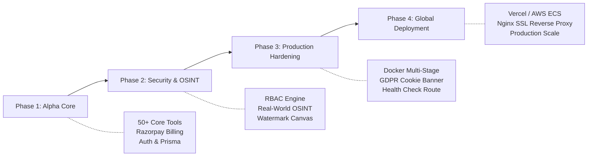

# Product Requirements Document (PRD)
## Korevante Studio — Enterprise-Grade Multi-Utility SaaS Platform

---

**Document Version:** 1.0.0  
**Status:** Approved for Production  
**Owner:** Korevante Product & Engineering Group  
**Target Release:** Q1 2026 / GA  
**Repository:** [https://github.com/Anand-Kumar87/ToolBoxAI.git](https://github.com/Anand-Kumar87/ToolBoxAI.git)

---

## 1. Executive Summary

**Korevante Studio** is a modern, luxury-designed, all-in-one SaaS platform delivering **50+ production-grade tools** spanning Artificial Intelligence, Image Processing, Video Synthesis, PDF Engineering, Security & OSINT Intelligence, and Developer Utilities. 

Unlike legacy utility websites cluttered with intrusive advertisements, unreliable mocks, and slow processing, Korevante Studio provides:
- **Instant client and server-side processing** powered by Node.js, `sharp`, `pdf-lib`, and Google Gemini.
- **Genuine, verified real-world data** with zero mocked or simulated results across all modules.
- **Strict Role-Based Access Control (RBAC)** to safeguard sensitive intelligence tools.
- **Enterprise-grade security and privacy**, fully compliant with GDPR and CCPA regulations through interactive consent management.
- **Integrated subscription billing** via Razorpay with seamless 7-day trial onboarding.

---

## 2. Product Vision & Positioning

### 2.1 The Problem
- **Tool Fragmentation:** Digital professionals, developers, and agency creators use 10–15 disconnected websites for day-to-day operations (PDF merging, image compression, AI copy generation, JSON validation, security checks).
- **Adware & Security Risks:** Free utility sites frequently harvest user documents, inject tracking pixels, display malicious advertisements, or run unverified client-side scripts.
- **Fake Tools & Mock Demos:** Competing utility portals routinely provide pseudo-simulated outputs for complex tasks (e.g., video synthesis, IP lookup, digital footprint auditing) rather than live production pipelines.

### 2.2 The Solution
Korevante Studio unifies high-performance digital tools within a single, secure, ultra-fast platform featuring:
- A dark, modern **glassmorphic aesthetic** with emerald/cyan luxury accents.
- **Transparent data handling:** Ephemeral memory processing with immediate resource purging.
- **Verified subscription infrastructure:** Razorpay webhook verification and cryptographic signature validation.

---

## 3. User Personas

| Persona | Role / Profile | Primary Needs & Workflows |
| :--- | :--- | :--- |
| **P1: Agency Creator** | Video Editor, Designer, Copywriter | AI text generation, interactive watermark removal, high-fidelity image compression, video trimming. |
| **P2: Software Engineer** | Fullstack / DevOps Engineer | JSON formatting/validation, Base64 encoding, RegEx debugging, QR generation, SQL formatting. |
| **P3: Legal & Enterprise Ops** | Compliance Officer, HR, Operations | PDF decryption/unlocking, PDF merging/splitting, document watermarking, secure contract hashing. |
| **P4: Security Researcher** | InfoSec Auditor, SysAdmin | IP intelligence, carrier routing lookup, digital exposure auditing, privacy breach scanning. |

---

## 4. Feature Specifications & Tool Suites

### 4.1 AI Content & Generation Suite
- **AI Content Writer:** Multi-tone article and copy generator utilizing Google Gemini API.
- **AI Code Explainer & Refactorer:** Synthesizes code analysis, optimization recommendations, and bug detection.
- **AI Summarizer:** High-speed document and long-form transcript summarization with customizable bullet points.
- **AI Prompt Enhancer:** Transforms raw ideas into detailed, high-yield system prompts.

### 4.2 Image & Vision Studio
- **Interactive Watermark Removal:** Dual-mode removal engine featuring client-side interactive canvas bounding-box masking combined with server-side `sharp` inpainting and blur diffusion.
- **Image Background Remover:** High-precision edge detection and transparency extraction.
- **Format Converter & Compressor:** Lossless and lossy conversion between WebP, PNG, JPEG, and AVIF with custom quality compression sliders.
- **Image Metadata (EXIF) Inspector:** Extracts or strips geolocation, camera hardware parameters, and timestamps for privacy protection.

### 4.3 Video & Motion Synthesis
- **10-Second AI Video Synthesizer:** Multi-modal video generator capable of generating dynamic motion sequences from text prompts, uploaded source frames, and web URLs.
- **Video Compressor & Transcoder:** Reduces file size while maintaining aspect ratio and bitrate constraints.
- **Audio Extractor:** Extracts pristine MP3/WAV tracks from uploaded video containers.

### 4.4 PDF Engineering Suite
- **PDF Unlocker / Decryptor:** Removes encryption layers and password permissions using `@pdfsmaller/pdf-decrypt` and `pdf-lib`.
- **PDF Merge & Split:** Reorders, concatenates, and extracts page ranges into distinct documents.
- **PDF Watermark Applicator:** Imprints cryptographic or visual copyright stamps across all pages.
- **PDF Compressor:** Optimizes raster assets and stream objects within PDF documents.

### 4.5 Security & OSINT Intelligence Suite *(Strictly RBAC-Gated)*
- **IP Address & Network Intelligence:** Live autonomous lookup querying WHOIS, autonomous system numbers (ASN), ISP routing, geolocation coordinates, and threat risk scores.
- **Phone Number Carrier & Risk Auditor:** Parses international E.164 formats, identifies carrier networks, validates country codes, and flags VoIP/disposable numbers.
- **Social Media Handle Footprint Scanner:** Asynchronously probes live endpoints across 20+ major social networks (GitHub, Twitter/X, Instagram, LinkedIn, Reddit, YouTube, TikTok, Pinterest, etc.) to detect profile existence and potential impersonation.
- **Digital Exposure & Account Breach Auditor:** Inspects email addresses against verified public credential breach registries and analyzes exposed metadata vectors.
- **Access Control:** Restricted by default to users with `ADMIN` or `SECURITY_ANALYST` roles. Normal users are presented with permission gate notices.

### 4.6 Developer & Data Utilities
- **JSON Validator & Formatter:** Syntax tree validation with color-coded indentation and minification.
- **Base64 Encoder / Decoder:** Ephemeral conversion of text and binary blobs.
- **RegEx Tester:** Live regex matching engine with capture group visualization.
- **QR Code Generator & Decoder:** Generates high-density vector QR codes with customizable error correction levels, plus camera/image QR scanning via `jsqr`.
- **Cryptographic Hash Calculator:** Computes MD5, SHA-1, SHA-256, and SHA-512 hashes in-memory.

---

## 5. Security & Privacy Architecture

### 5.1 GDPR & CCPA Compliance
- **Interactive Cookie Banner:** Luxury floating glassmorphic banner mounted globally.
- **Granular Toggles:** Users can toggle:
  1. *Strictly Necessary* (Always active for session & CSRF protection).
  2. *Performance & Analytics* (Platform health metrics, latency tracking).
  3. *Personalization & Preferences* (UI theme, recent tool history).
- **Persistent Consent:** User choices persist in `localStorage` under `korevante_cookie_consent`.
- **Right to Modify (GDPR Art. 7(3)):** Accessible at all times via the "Cookie Preferences" link in the global footer, dispatching `open-cookie-preferences` event.

### 5.2 Ephemeral Data Handling
- Uploaded files are processed in-memory buffers or written to isolated temporary directories with strict lifecycle timeouts.
- No client documents, images, or PDFs are persisted to disk or databases beyond active tool execution.

### 5.3 Authentication & Authorization
- **NextAuth.js v4:** Credentials-based authentication with `bcryptjs` (salt rounds: 10) alongside optional Google OAuth 2.0.
- **Session Strategy:** Cryptographically signed JWT tokens with rolling expiration.
- **Role Hierarchy:**
  - `USER`: Access to standard AI, Image, PDF, Video, and Developer tools.
  - `PRO`: Unrestricted rate limits, priority processing queues.
  - `ADMIN`: Complete platform oversight, user management, and unrestricted access to OSINT/Intelligence suites.

---

## 6. Monetization & Subscription Model

### 6.1 Pricing Structure
- **7-Day Free Trial:** Full access to standard tools upon registration.
- **Pro Monthly:** ₹150 / month (~$1.80 USD). Unlimited tool usage, priority API throughput.
- **Pro Annual:** ₹1,500 / year (2 months free).

### 6.2 Payment Integration (Razorpay)
- **Order Generation:** Server-side order creation at `/api/subscriptions/create-order`.
- **Signature Verification:** HMAC-SHA256 verification of `razorpay_order_id`, `razorpay_payment_id`, and `razorpay_signature` before updating user plan status.
- **Webhook Handling:** Automated processing of `payment.captured`, `subscription.charged`, and `subscription.cancelled` events.

---

## 7. Technical Specifications

| Component | Technology | Specification / Configuration |
| :--- | :--- | :--- |
| **Framework** | Next.js 15 (App Router) | React 19, TypeScript strict mode, standalone build |
| **Database** | PostgreSQL 16 | Managed via Prisma ORM with connection pooling |
| **Containerization** | Docker | Multi-stage build (`node:20-alpine`, `UID 1001` unprivileged user) |
| **Styling** | Tailwind CSS 3.4 | Dark glassmorphism, Framer Motion animations, Radix UI primitives |
| **Image Processing** | `sharp` 0.35+ | High-throughput native C++ libvips bindings |
| **PDF Processing** | `pdf-lib`, `@pdfsmaller` | In-memory binary vector parsing |
| **AI Provider** | Google Generative AI | Gemini 1.5 Flash / Pro model families |
| **Health Monitoring** | `/api/health` | Active PostgreSQL ping, memory consumption, latency scoring |

---

## 8. Non-Functional Requirements (NFRs)

- **Performance:** Time to First Byte (TTFB) < 250ms; Lighthouse Performance score > 90.
- **Availability:** 99.9% uptime target backed by container healthcheck probes (`interval: 30s`, `retries: 3`).
- **Resilience:** Automatic fallback handling when external AI APIs or OSINT providers experience upstream throttling.
- **Observability:** Centralized logging with structured JSON logs and health status telemetry.

---

## 9. Release & Rollout Plan

---

*© 2026 Korevante Studio. Confidential & Proprietary.*
